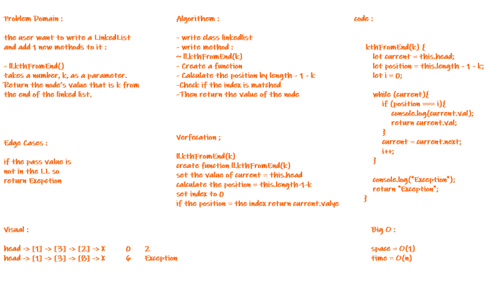

# Singly Linked List

## Challenge Summary

Need to create a node and link list constructor class along with some methods 

## Challenge Description

Create a linked list class that has methods to append, insert before, includes nodes  ,toString , append , insertBefore , insertAfter and kthFromEnd method  .

## Approach & Efficiency

The Big O 

- space: O(1)
- time: O(n)

---

## API

7 Methods --->

1- Insert Function --> which takes any value as an argument and adds a new node with that value to the head of the list .

2- Includes Function -->  which takes any value as an argument and returns a boolean result depending on whether that value exists as a Node’s value somewhere within the list.

3- ToString Function --> which takes in no arguments and returns a string representing all the values in the Linked List, formatted as:
"{ a } -> { b } -> { c } -> NULL"

4- append --> which adds a new node with the given value to the end of the list

5 - insertBefore --> which add a new node with the given newValue immediately before the first value node

6- insertAfter --> which add a new node with the given newValue immediately after the first value node

7- kthFromEnd --> which takes a number, k, as a parameter. Return the node’s value that is k from the end of the linked list.

---

# first White Board :

# Second White Board :

---

# THE END

